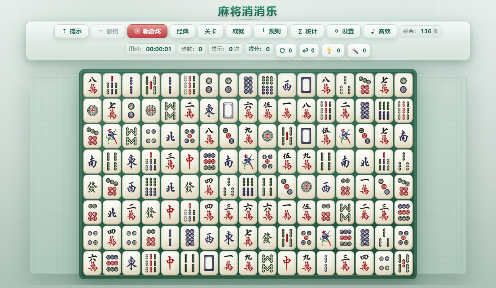
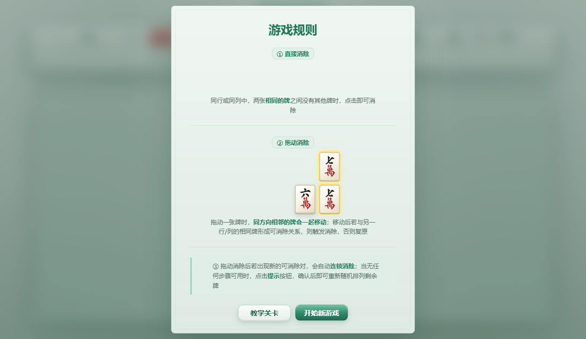

# 麻将消消乐

纯 HTML/CSS/JavaScript 开发的网页麻将消消乐游戏，无需任何框架或构建工具，直接双击 `index.html` 即可游玩。

## 截图

| 游戏主界面 | 规则说明 |
|:---:|:---:|
|  |  |

## 游戏规则

### 牌组
- **136张牌**：万子 36（1-9万×4）、条子 36（1-9条×4）、筒子 36（1-9筒×4）、字牌 28（东南西北中发白×4）
- 开局行列数由视口**自适应**：横屏默认 17×8，竖屏 8×17，极小屏幕自动枚举最优布局并计算牌尺寸

### 消除规则

| 规则 | 说明 |
|------|------|
| 直接消除 | 同行或同列中，两张相同牌之间**无任何牌遮挡**时，点击即可消除 |
| 拖动消除 | 拖动一张牌时，**同方向相邻的牌会一起移动**；松手后若与其他行/列的相同牌满足消除条件，则触发消除，否则复原 |
| 连锁消除 | **拖动**消除后，若移动产生了新的可消除对则持续连锁（只连锁移动新增的配对，已存在的配对需手动点击） |

### 操作方式
- **点击**：直接消除同行/列中无遮挡的相同牌
- **拖动**：点击并拖动，超过阈值后锁定横/纵方向；同方向上与起点相邻的牌会一起移动
- 移动受阻挡时自动停在前一格，无法移出棋盘边界

## 按钮功能

| 按钮 | 功能 |
|------|------|
| 规则 | 查看带动画演示的游戏规则说明 |
| 提示 | 高亮显示当前可操作的步骤（含按住哪张牌、往哪个方向拖）；确认无可消除步骤后弹窗询问是否**重新随机排列**剩余牌 |
| 撤销 | 还原上一步操作（最多保留 20 步，增量渲染无闪烁） |
| 新游戏 | 重新洗牌，预加载牌图并播放发牌动画后开始新局 |

## 存档与最佳成绩

- 对局进行中自动保存到浏览器 `localStorage`（棋盘快照 + 步数 + 用时），刷新或关闭页面后再次打开会询问"**继续上局**"
- 通关后记录**最佳成绩**（最短用时、最少步数、完成局数），显示在胜利界面
- 教学关卡不入档；通关或开新局会清空存档

## 胜利条件

消除所有 136 张麻将牌即通关，胜利界面显示本局用时、有效操作步数与历史最佳成绩。

## 文件结构

```
麻将消消乐/
├── index.html                  # 入口文件
├── README.md
├── .gitignore
├── package.json                # Jest 测试配置
├── jest.config.js
├── css/
│   ├── reset.css               # CSS 重置
│   ├── main.css                # 整体布局与 UI
│   ├── board.css               # 棋盘样式
│   ├── tile.css                # 牌的外观与状态（选中/消除/发牌动画）
│   ├── animations.css          # 动画关键帧
│   └── tutorial.css            # 规则教学动画样式
├── js/
│   ├── constants.js            # 全局常量与视口自适应布局
│   ├── tileDefinitions.js      # 牌型定义与洗牌
│   ├── boardState.js           # 不可变棋盘数据结构
│   ├── gameLogic.js            # 消除规则、连锁消除、重排
│   ├── movementLogic.js        # 牌组选中与碰撞检测
│   ├── hintSystem.js           # 提示算法（与拖拽共享同一选组实现）
│   ├── renderer.js             # DOM 渲染（全量 + 增量 diff）
│   ├── animationController.js  # 动画序列（滑动/消除/发牌）
│   ├── imagePreload.js         # 牌图预加载
│   ├── timer.js                # 独立计时器
│   ├── dragController.js       # 拖拽输入处理（依赖注入）
│   ├── soundController.js      # Web Audio 程序化音效
│   ├── bgmController.js        # Web Audio 程序化 BGM
│   ├── tutorial.js             # 规则教学动画逻辑
│   ├── gameController.js       # 游戏状态机与存档
│   └── main.js                 # 入口与初始化
├── assets/
│   ├── images/tiles/           # 麻将牌图片（AI 生成）
│   └── screenshots/            # 游戏截图
│       ├── gameplay.png        # 游戏主界面截图
│       └── tutorial.png        # 规则说明截图
├── dist/                       # 打包产物（Windows 安装包）
└── tests/                      # Jest 单元测试
```

## 图片素材

`assets/images/tiles/` 目录下的全部麻将牌图片均由 **Seedream 4.5** AI 生成。

## 许可证

本项目基于 [Apache License 2.0](LICENSE) 开源。

## 开源依赖

| 项目 | 用途 | 许可证 |
|------|------|--------|
| [Tauri](https://tauri.app) | 将 Web 应用打包为桌面可执行文件 | MIT / Apache-2.0 |
| [Pake](https://github.com/tw93/Pake) | 基于 Tauri 的网页打包工具 | MIT |
| [Jest](https://jestjs.io) | JavaScript 单元测试框架 | MIT |
| [NSIS](https://nsis.sourceforge.io) | Windows 安装包制作工具（构建时使用） | zlib/libpng |

游戏本体（`index.html` / `css/` / `js/`）为纯原生实现，运行时无任何第三方依赖。

## 本地开发

游戏本体无需任何构建步骤，直接在浏览器中打开 `index.html` 即可。

如需运行单元测试（jsdom + Babel，真实 ESM 模块导入）：

```bash
npm install
npm test          # 测试 + 覆盖率
```
